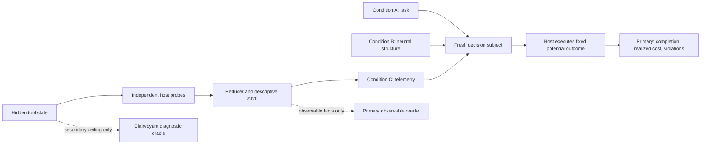

# ToolRoute System Flow

The downloadable JPEG is retained at
`/Users/manuagrawal/.codex/visualizations/2026/08/28/01a049b0-d80a-74d2-838e-3bdedd1fce16/toolroute-experiment-flow.jpg`.
This versioned Mermaid source is the repository artifact.

