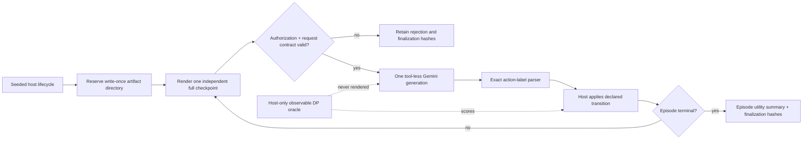

# RetryBudget v0.2 Pre-Provider Audit

**Status:** complete self-review; Gemini canary remains intentionally disabled
pending an independent review and a narrow recorded authorization.

## Scope and conclusion

The present question is narrow and useful: given the same pending-work task,
does a truthful current host checkpoint improve an LLM's operational action
relative to a semantic-only prompt (A) and a neutral same-shape state envelope
(B)? The source of the checkpoint is deliberately out of scope for this first
benchmark. The simulator is a deterministic synthetic host lifecycle; it is
not represented as production telemetry or a real outage study.

The implementation is ready for one development-only Gemini C canary after
independent review. No provider request has been made in this hardening pass.
The main-study A/B/C cohort remains a later, separately frozen decision.

## Canary flow

## Transfer audit from ToolRoute

| ToolRoute lesson | RetryBudget disposition |
| --- | --- |
| Do not expose an oracle recommendation or latent state. | C exposes only the canonical transition/oracle inputs; host-only artifacts contain action values and best actions. `work_item` is excluded from C. |
| Fresh checkpoints must be complete for stateless decisions. | Every provider generation gets one independent full checkpoint and no supplied model history. |
| A waiting action needs real lifecycle semantics. | `wait` preserves pending work, quota, and a logical deadline until the visible retry-after boundary. |
| Neutral B needs the same envelope, not an invented “empty” treatment. | B renders C's exact field names and option order with `NEUTRAL` values. It is not claimed to have exactly equal provider tokens; request usage is retained. |
| Balance action label positions rather than assuming randomness. | A deterministic five-position rotation is unit-tested for every fixed state across five adjacent seeds. |
| A multi-call attempt needs reservation, exact capture, error retention, and finalization. | The scenario-owned runner reserves first, writes request/response/error/result files once, records only redacted runner/provider errors, and finalizes all terminal paths. |
| Authorization and actual request settings must be bound and rechecked. | Provenance binds the manifest digest; every generation rechecks authorization; adapter, endpoint suffix, forbidden native tools/system instructions, temperature, and output limit are validated before transport. |
| An observable oracle cannot be scored with hidden facts. | The DP reads only the visible C fields. Its oracle state is retained outside the model. |

## Specific checks completed

- Seeded observable magnitudes now vary; seeds no longer simply reorder five
  identical prompts. All generated initial regimes retain one unique best
  action.
- The best fixed-action calibration policy is 54.1% below the observable oracle
  over developer seeds 0--11. This is a shortcut check, not a behavioral
  result.
- Non-zero telemetry delivery delay, missingness, or corruption fails closed.
  We do not claim robustness to those effects without a calibrated extension.
- The main trajectory metric is realized episode utility and its difference
  from oracle episode utility. Local action-value gaps are diagnostic only;
  they are not summed across turns.
- A new seed-61 oracle calibration has valid terminal hashes at
  `experiments/g2-calibrations/retrybudget-v0-2/20260830T205316.217706Z-retrybudget-v0-2-b63c79c940a3479fa06481451fb92dab/`.
- The full local regression suite passes: **132 tests**. This includes mock
  authorization rejection, complete trajectory capture, malformed provider
  output, redacted unexpected runner error, prompt isolation, seed variation,
  position balance, manifest-artifact binding, atomic duplicate-trajectory
  prevention, manifest-enforced generation cap, and terminal finalization.

## Intentional limits, not unresolved defects

1. The C-only canary cannot show a telemetry effect; it only validates Gemini
   transport and lifecycle capture. It is excluded from a paper denominator.
2. The first benchmark is synthetic and lossless. This supports a controlled
   information-ablation claim, not a production-observability claim.
3. Provider generations are independent, so future A/B/C analysis must use
   episode as its primary unit and cluster any turn-level diagnostic by
   trajectory. It must not treat turns as independently randomized samples.
4. A full paper manifest still needs a frozen seed block, condition/model
   grid, inclusion/exclusion rules, primary episode-utility analysis, and
   sample-size/power rationale. The canary does not pre-authorize any of those.

## Exact next action after independent review

Approve only the manifest
`1301282d9945f57556c5578f35dc84f26ef87043a209625eb1f7a5e8ae010d54`, then
record a narrow RetryBudget C-only Gemini development exception in `PROTOCOL.md`
and bind the same digest in `PROVENANCE.json`. Run the documented command once,
audit the finalization hashes and request records, and revoke authorization.
Do not alter ToolRoute code, artifacts, or its completed cohort.
